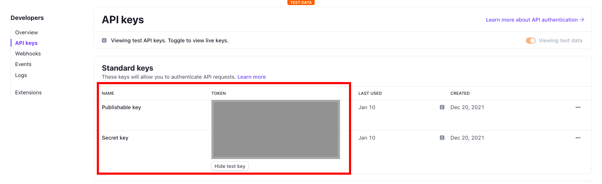
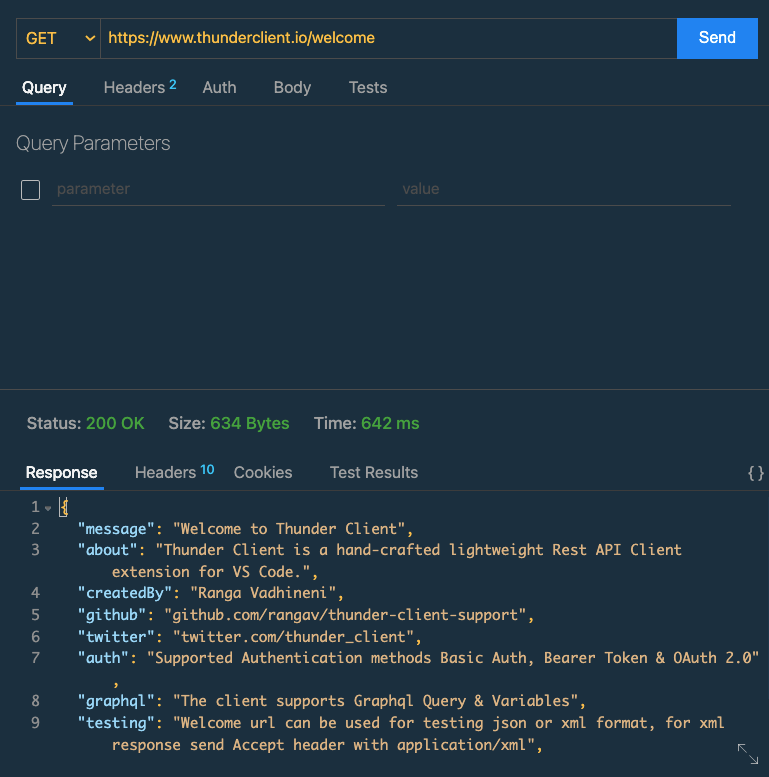
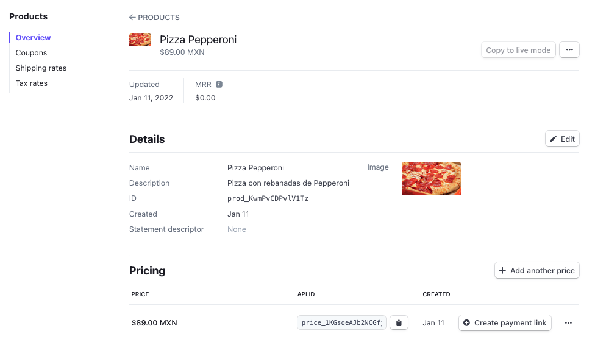
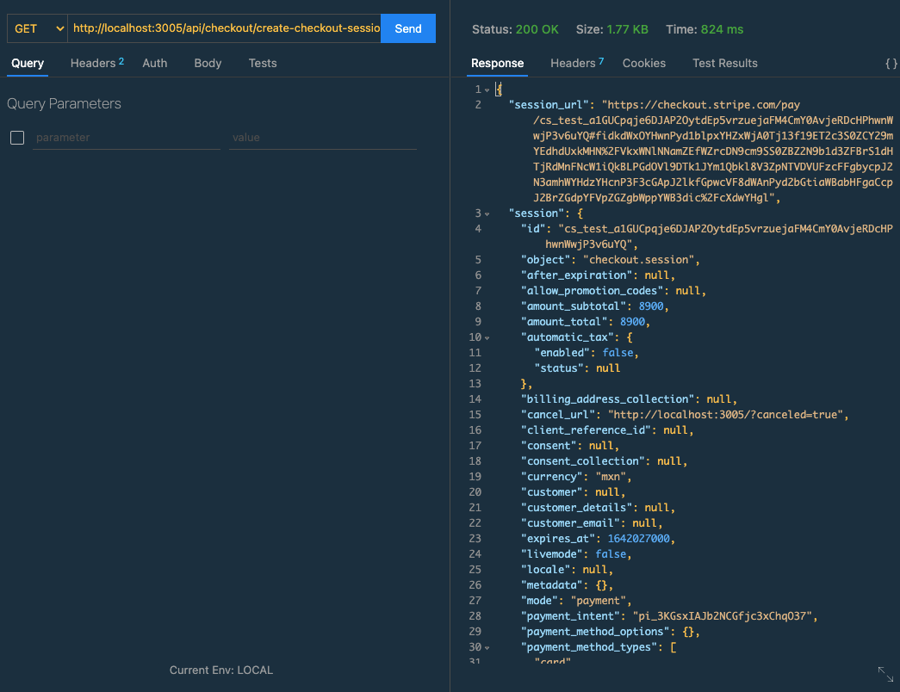
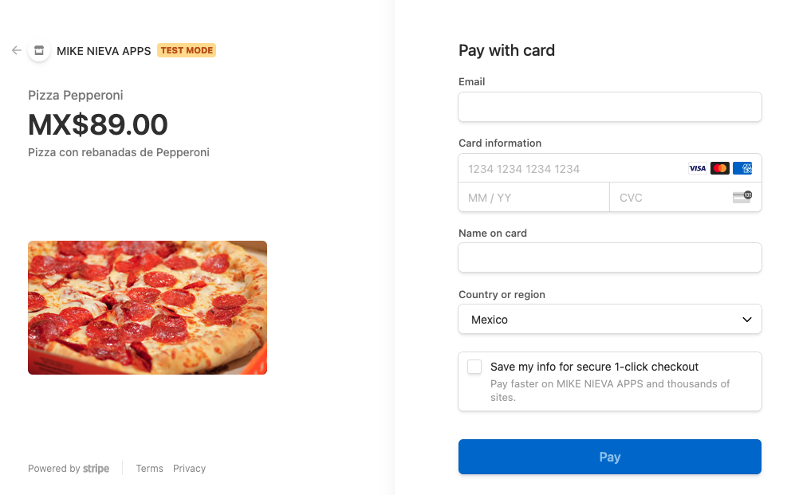

# Fullstack React con Stripe Checkout - Parte I: ExpressJS con sesiones de Stripe

## Introducción

En esta serie de 10 artículos, construiremos una aplicación MERN (MongoDB, ExpressJS, React y Node.js) de comercio electrónico.

Está dirigido a entusiastas en React que han desarrollado aplicaciones sencillas y ahora buscan construir con mayor nivel de dificultad.

La gestión de estado ("state management") con React la realizaremos con `useContext` y `useReducer`.

Puedes ver la aplicación final y el repositorio en los siguientes enlaces. Será una pizzería.

**Demo**: [LINK](https://escuelafrontend-pizza-mikenieva.netlify.app)

**Repositorio de aplicación terminada:** [LINK](https://github.com/mikenievacom)


Con el objetivo claro, nuestro conjunto de tecnologías serán:


```
- FRONTEND
	- React (create-react-app)
		- useContext
		- useState
		- useEffect
		- react-router-dom (v6)
	- TailwindCSS
	- axios

- BACKEND
	- Node.js
		- express
		- express-validator
		- mongoose
		- jsonwebtoken
		- cors
		- dotenv
		- bcryptjs

- DATABASE
	- MongoDB
		- MongoDB Compass
		- MongoDB Atlas

- APIs
	- Stripe Checkout
```

Comencemos con la parte I.

---

## Índice

- ¿Qué encontrarás en este artículo?
- Instalación de software y extensiones
    - Node.js
    - Visual Studio Code
	- GIT
    - Thunder Client
- Creación de cuentas
    - GitHub
    - Stripe
- Arquitectura de carpetas y preparación de ambiente
    - Cliente
    - Servidor
- Desarrollo de aplicación con Express.js
- Gestión de ruta con Stripe Checkout
- Preparación para el siguiente artículo


## ¿Qué encontrarás en este artículo?

En este artículo, construiremos el servidor con `Express.js` dentro de nuestra aplicación y realizaremos la creación de cuenta de `developers` en Stripe. 

Posteriormente, crearemos un servicio que permita la creación de una sesión con `Stripe Checkout`.


## Instalación de software y extensiones

Para comenzar, te pediremos que instales los siguientes programas y diversas extensiones en Visual Studio Code.

- **NodeJS** - [https://nodejs.org/es/](https://nodejs.org/es/)

- **Visual Studio Code** - [https://code.visualstudio.com/](https://code.visualstudio.com/)

- **GIT** - [https://git-scm.com/](https://git-scm.com/)

- **MongoDB** - [https://docs.mongodb.com/manual/administration/install-community/](https://docs.mongodb.com/manual/administration/install-community/)

- **MongoDB Compass** - [https://www.mongodb.com/products/compass](https://www.mongodb.com/products/compass)

- **Extensión VSC - Thunder Client.** Dentro de la sección de extensiones, busca e instala `Thunder Client`. Nos funcionará para realizar el consumo de los servicios API del Backend.


## Creación de cuentas

Es posible que ya te hayas registrado en estos dos servicios. De lo contrario, crea una cuenta en ellas.

**GitHub.** Crea una cuenta en [este link](https://github.com).

**Stripe.** Crea una cuenta en [Stripe](https://stripe.com). No es necesario que estés en Estados Unidos para poder usar `Stripe Developers`. Trabajaremos con el ambiente de `TEST DATA`.

Una vez realizado esto, nombre tu cuenta para que te permita desbloquear tus llaves públicas y privadas.


Finalmente, accede a tu sección de [API Keys](https://dashboard.stripe.com/test/apikeys) y ten a la mano tus llaves públicas y privadas.

**Jamás permitas que estas llaves estén al alcance del público. Solo contigo y/o tu equipo.**



Excelente, preparemos nuestra aplicación.

## Clonar repositorio 

Para comenzar a desarrollar, partiremos de [este repositorio](https://github.com/mikenievacom/ef-002-fullstack-react-stripe-01-start) que clonarás y a continuación hablaremos de su arquitectura de carpetas.

```shell
$ git clone https://github.com/mikenievacom/ef-002-fullstack-react-stripe-01-start
```

## Arquitectura de carpetas e instalación de dependencias

Observemos las diferentes carpetas dentro del proyecto:

```
|- ef-002-fullstack-react-stripe-01-start/
|	|- client/
|	|- server/
|		|- package.json
|	|- .gitignore
```

- **client.** Dentro colocaremos nuestra aplicación de React. Lo haremos en posteriores artículos.

- **server.** Dentro estará nuestra aplicación con `ExpressJS`. Encontrarás dentro un archivo `package.json` que incluirá las dependencias que deberemos instalar dentro de la carpeta.

Nos situaremos dentro de la carpeta `server` e instalaremos las dependencias.

```shell
$ cd ef-002-fullstack-react-stripe-01-start
$ cd server
$ npm install
```

Se generará la carpeta `node_modules` y con esto, las depedencias instaladas fueron:

- **`cors` -** Librería que permite dar flexibilidad y control a las peticiones que vengan de clientes externos. Es indispensable al momento que comencemos a utilizar la interacción `FRONTEND <> BACKEND`.

- **`dotenv` -** Librería que permite generar variables de entorno. Dependiendo de si te encuentras en un ambiente local o producción, el valor de las variables cambiará, procurando la seguridad y dinamismo de la aplicación.

- **`express` -** Librería que permite gestionar rutas dentro de la aplicación, así como reglas establecidas para acceder a las mismas con el uso de `middlewares`.

- **`stripe` -** Librería oficial de Stripe para el uso de su API.

Antes de avanzar, instalaremos una dependencia a nivel global llamada `nodemon`, que permitirá monitorear cada cambio en nuestros archivos y al existir uno, reiniciar el servidor.

```shell
$  npm install -g nodemon
```


## Creación de servidor con ExpressJS

Vamos a crear un archivo `index.js`, el cual contendrá toda la lógica del servidor de nuestra aplicación. La misma estará dividida en 4 secciones:

- **IMPORTACIONES.** Se refiere a todas las importaciones de otros archivos JavaScript de la aplicación a este, librerías

- **MIDDLEWARES.** Todas las ejecuciones previas al acceso de rutas. Podemos trazar reglas como autenticación, revisión de peticiones, configuraciones, etc.

- **RUTAS.** Cuando la petición acceda al servidor, deberá canalizarse a través de las rutas para llegar a la función elegida, también conocida como **controlador**.

- **SERVIDOR.** Permite "levantar" el servidor y establecer la configuración del puerto.

Con estas secciones, realizamos las ejecuciones para permitir la actividad de nuestro servidor.

- Importamos `express` e invocamos una instancia bajo la variable `app`.

- Importamos `cors` y lo invocaremos en el área de `middlewares`, utilizando `app.use(cors)`.

- Importamos `dotenv` a través de `require` y a través de su método `.config` lo invocamos.

- Generamos el ruteo utilizando `app.use`. En el primer argumento se establecerá la ruta con la cual los clientes llegarán a ella. En el segundo argumento utiliza la importación de un archivo llamado `checkout.js`, el cual crearemos más adelante. Usualmente se establece un tipo (`users`, `checkout`, `payments`, `products`, etc) como nombre de archivo y dentro estarán todos sus diferentes métodos.

- Establecemos nuestro puerto, usando `process.env.PORT`. Esta es una variable de entorno.

- Levantamos nuestro servidor con `app.listen()` estableciendo como primer argumento el puerto donde queremos que nuestro servidor aperture su acceso y el segundo argumento es un mensaje con `console.log()` que me dará indicación de que fue exitoso.

```javascript

// 1. IMPORTACIONES
const express 			= require("express")
const cors				= require("cors")

const app				= express()

require("dotenv").config()

// 2. MIDDLEWARES
app.use(cors())

// 3. RUTAS
app.use("/api/checkout", require("./routes/checkout"))

// 4. SERVIDOR
const PORT = process.env.PORT
app.listen(PORT, () => console.log(`Servidor activo en ${PORT}`))

```

Una vez realizado esto, crearemos archivos y carpetas:

- **`./server/.env`** - Permite establecer nuestras variables de entorno. En este caso, incluimos el puerto donde estaremos trabajando el acceso a nuestro servidor.

```
PORT=3005
```

- **`./server/routes/checkout.js`** - En este archivo, estableceremos
 los diferentes métodos y los conectaremos con un **controlador**, el cual será la función que se ejecutará tan pronto la petición toque esa ruta. Observa que estamos importando `checkoutController` y cuando lo usamos en el `router.get` utilizamos el método `createCheckoutSession`. Ese será el nombre de nuestro controlador que crearemos más adelante.

`./server/routes/checkout.js`
```javascript

// 1. IMPORTACIONES
const express 		= require("express")
const router		= express.Router()

const checkoutController	= require("./../controllers/checkoutController")

// 2. RUTEO
router.get("/create-checkout-session", checkoutController.createCheckoutSession)

// 3. EXPORTACIÓN
module.exports = router

```

- **`./server/controllers/checkoutController.js`** - En este archivo, estableceremos el archivo que contendrá los controladores.

`./server/controllers/checkoutController.js`
```javascript
// 1. IMPORTACIONES


// 2. CONTROLADORES


// A. STRIPE CHECKOUT
exports.createCheckoutSession = async (req, res) => {

	res.send("hola")

}

```

Con esto listo, revisemos que funciona todo y hagamoso una primera prueba con **Thunder Client**.

## Manejo de peticiones con Thunder Client

Anteriormente, habíamos realizado nuestra instalación sobre Thunder Client. 

Selecciónalo en Visual Studio Code y observarás un botón de color azul llamado "New Request". Darás click al mismo. Posteriormente, verás un cliente el cuál indica el método al cual quieres acceder y un botón que dice "Send". 

Envía una petición a este servicio por defecto y obtendrás una respuesta, como se muestra a continuación.



Perfecto. Vamos a levantar nuestro servidor.

En terminal, situados en `server`, escribimos el `script` que establecimos en `package.json` llamado `dev`:

```shell
$ npm run dev
```

Si no existió problema, obtendrás un mensaje que dice `Servidor activo en 3005`.

Ahora, en **Thunder Client** establece en la zona de petición.

```
GET  |  http://localhost:3005/api/checkout/create-checkout-session
```

El resultado será un mensaje que dice `hola`.

Si funcionó, ya tenemos armado nuestro proceso de rutas en `express` y es momento de establecer `Stripe Checkout`.

## Gestión de ruta con Stripe Checkout

Realizaremos la extracción de la llave secreta de `stripe` de nuestra cuenta y la colocaremos en nuestro archivo `.env` bajo la propiedad de `STRIPE_KEY`. 

Encuéntrala en [este link](https://dashboard.stripe.com/test/apikeys).

La integramos en nuestro archivo `.env` de esta forma, en un tipo de dato `String`, con doble comilla. Podrás notar que empieza con `sk_test_`.

```.env
PORT=3005
STRIPE_KEY="sk_test_xxxxxxxxxxxxxxxxxxxxxxxxxx..."
```

Es momento de realizar la importación y ejecución del `checkout`. 

Nos situamos en `checkoutController.js` y ejecutaremos:

- Una importación con la librería de `stripe`, conectando nuestra llave privada para liberar el uso de nuestra cuenta. Es importante siempre conectarla con variables de entorno.

- Es prioritario establecer la función de manera asíncrona (`async`) dentro del controlador porque estableceremos conexiones a servicios externos. No olvides colocar los parámetros `req` y `res`.

- Dentro de nuestro controlador, sucederán diferentes acciones con `stripe`. 
	- Crearemos una variable llamada `session` y utilizaremos parte de sus métodos `stripe.checkout.sessions.create()`
	- Como argumento de `create`, generaremos un objeto, el cual contendrá 4 propiedades.
		- `line_items`. Un arreglo de objetos que contendrá todo el carrito de compras. Cada objeto tiene un `price` que significará el `priceID` del producto creado en Stripe y la cantidad de compra. Puedes tener múltiples objetos.
		- `mode`. Tipo de pago establecido (único o suscripción).
		- `success_url`. Si el proceso de compra sucede correctamente, la url a la cual el usuario será dirigido.
		- `cancel_url`. Si el proceso de compra falla, esta será la url a la cual el usuario será dirigido.
	- Finalmente, establecemos un `res.json()` el cual devolverá la respuesta al cliente con la información necesaria. Tendremos dos propiedades, una para obtener la URL de pago y otra con toda la información pública del `checkout`.

`./server/controllers/checkoutController.js`

```javascript

// 1. IMPORTACIONES
const stripe = require("stripe")(process.env.STRIPE_KEY)

// 2. CONTROLADORES
// A. STRIPE CHECKOUT
exports.createCheckoutSession = async (req, res) => {

	// CREACIÓN DE UNA SESIÓN
	const session = await stripe.checkout.sessions.create(
		{
			line_items: [
				{
					price: "id",
					quantity: 1
				}
			],
			mode: "payment",
			success_url: `http://localhost:3005/?success=true`,
			cancel_url: `http://localhost:3005/?canceled=true`
		}
	)

	// RETORNO DE LA SESIÓN AL CLIENTE
	res.json({
		session_url: session.url,
		session
	})

}

```

Si en este momento lo intentamos, fallará porque nos falta generar un producto en Stripe y colocarlo directamente en `line_items`. Realicemos el último paso.

## Creando un producto en Stripe y enlazando su identificador

Vamos a Stripe y generemos un producto.

Accede a la sección de `Products` y posteriormente a `Add product`.

Llena los campos y considera establecer un precio `Standard pricing` con `ONE TIME`. Opcionalmente, puedes descargar una imagen desde [Unsplash](https://unsplash.com). Te piden que sea menos de 2mb.

El resultado será este:



En la sección de `PRICING`, tomarás el priceID (**no el productID**) y lo insertarás en tu controlador en la propiedad de `price` dentro de `line_items`:

`./server/controllers/checkoutController.js`

```javascript

// 1. IMPORTACIONES
const stripe = require("stripe")(process.env.STRIPE_KEY)

// 2. CONTROLADORES
// A. STRIPE CHECKOUT
exports.createCheckoutSession = async (req, res) => {

	// CREACIÓN DE UNA SESIÓN
	const session = await stripe.checkout.sessions.create(
		{
			line_items: [
				{
					price: "price_1KGsqeAJb2NCGfjckxktJAij",
					quantity: 1
				}
			],
			mode: "payment",
			success_url: `http://localhost:3005/?success=true`,
			cancel_url: `http://localhost:3005/?canceled=true`
		}
	)

	// RETORNO DE LA SESIÓN AL CLIENTE
	res.json({
		session_url: session.url,
		session
	})

}

```

Hagamos la prueba con Thunder Client y verifiquemos que funcione. El resultado será la devolución de un objeto el cual contendrá nuestra `session_url` y el resto de información de la sesión.




Toma la URL de la sesión y ábrela en tu navegador.

El resultado será el proceso de pago ("checkout") con los datos del producto que creaste.



Para realizar pruebas de pago, te recomendamos utilizar las tarjetas de pago ficticias de Stripe. Las puedes encontrar en este [link](https://stripe.com/docs/testing).

## Siguiente artículo

A continuación, realizaremos el proceso de autenticación para nuestro `backend` y vincularemos al usuario con el `checkout`.

Puedes encontrar el resultado final en la rama `end` dentro del [repositorio que clonaste al inicio.](https://github.com/mikenievacom/ef-002-fullstack-react-stripe-01-start).

Te veo en el siguiente artículo.